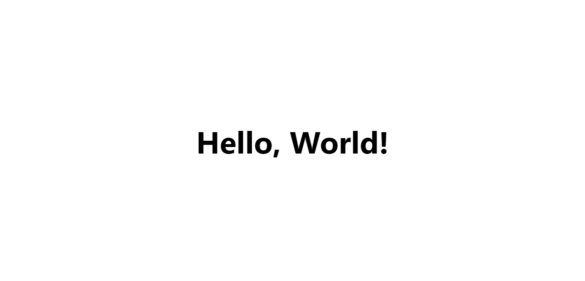

# Hello Rails React

> In this project I used Ruby On Rails, React, and Redux to design a single-page application that displays a random greeting fetched from a Rails API.

To see the repo of the React-Redux front end, click [here](https://github.com/YuvrajM108/hello-rails-react-front-end/).



## Built With

- Ruby On Rails
- React JS
- Redux
- HTML
- CSS

## Getting Started

### Prerequisites

- Install a code editor(VSCode or Atom will do the trick)
- Install Yarn
- Install Git Bash

### Setup

- In a folder of your choice, clone this repo using ```git clone https://github.com/YuvrajM108/hello-rails-react.git``` in your git bash.
- ```cd hello-rails-react``` and then ```code .``` or ```atom .``` depending on your editor to open the project

### Install

- In your integrated command line, ```bundle``` to install all Ruby gems.

- In your integrated command line, ```rails webpacker:install``` to install webpacker.

- In your integrated command line, ```yarn``` to install all node dependencies.

### Usage

- In your integrated command line, ```rails server``` will start the virtual server.

- Visit ```localhost:3000``` in your browser to run the application.

## Authors

👤 **Yuvraj Manoo**

- GitHub: [@YuvrajjM108](https://github.com/YuvrajM108)
- Twitter: [@YuvrajM108](https://twitter.com/YuvrajM108)
- LinkedIn: [Yuvraj-Manoo](https://linkedin.com/in/yuvraj-manoo)

## 🤝 Contributing

Contributions, issues, and feature requests are welcome!

## Show your support

Give a ⭐️ if you like this project!

## 📝 License

This project is [MIT](./MIT.md) licensed.
